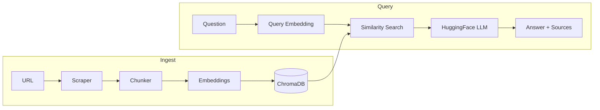

# Cortex RAG — Guide

This document explains **what the tool does**, **how to use it from a user perspective**, and **how it works under the hood** — in a straightforward but detailed way.

For installation, quick start, and basic commands, see [README.md](../README.md).
For the step-by-step development tutorial, see [INSTRUCTIONS.md](INSTRUCTIONS.md).

---

## 1. What is it for?

**Cortex** is a CLI application that:

1. **Scrapes** technical articles from URLs you provide (httpx + BeautifulSoup).
2. **Chunks** the content into overlapping fragments suitable for embedding.
3. **Indexes** chunks into a local **ChromaDB** vector store with sentence-transformer embeddings.
4. **Retrieves** relevant chunks using semantic similarity search (with optional query expansion via RRF).
5. **Generates** grounded answers using **HuggingFace Inference API** (default) or **OpenAI** (optional).
6. **Evaluates** retrieval quality with MRR, Hit Rate, and NDCG metrics.
7. **Visualizes** the knowledge base (t-SNE document map) and experiment comparisons (bar charts).

In one line: **URLs → scraping → chunking → embeddings → ChromaDB → Q&A with evaluation**.

---

## 2. High-level architecture

The design follows **RAG** (Retrieval-Augmented Generation): retrieval is local and cheap (embeddings on CPU); answer generation uses HuggingFace's free inference tier.

```
Ingest phase (cortex add)
  URL
    → httpx fetch + BeautifulSoup parse
    → noise removal (nav, footer, scripts)
    → recursive character text splitting
    → SHA-256 chunk IDs
    → sentence-transformer embeddings (CPU)
    → ChromaDB upsert (disk persistence)

Query phase (cortex ask)
  User question
    → (optional) LLM generates query variants
    → embedding + similarity search in ChromaDB
    → (optional) Reciprocal Rank Fusion merges rankings
    → top-K chunks as context
    → HuggingFace chat completion
    → answer + source URLs
```



---

## 3. Modules and responsibilities

Module boundaries are intentionally sharp: one file, one primary area.

| Module | Responsibility |
| --- | --- |
| [`config.py`](../src/cortex/config.py) | Pydantic-settings configuration from `.env`: HF token, models, ChromaDB path, chunking params, retrieval settings |
| [`scraper.py`](../src/cortex/scraper.py) | HTTP fetch (httpx), HTML parsing (BeautifulSoup), noise tag removal, content extraction, `Article` dataclass |
| [`chunker.py`](../src/cortex/chunker.py) | Recursive character text splitting with overlap, deterministic SHA-256 chunk IDs, `Chunk` dataclass |
| [`store.py`](../src/cortex/store.py) | ChromaDB lazy initialization, cosine distance HNSW index, upsert/query operations, embedding function setup |
| [`retriever.py`](../src/cortex/retriever.py) | Simple retrieval or multi-query expansion with Reciprocal Rank Fusion, `SearchResult` dataclass |
| [`generator.py`](../src/cortex/generator.py) | HuggingFace InferenceClient, retry decorator with exponential backoff, answer generation, query variant generation |
| [`evaluator.py`](../src/cortex/evaluator.py) | MRR, Hit Rate, NDCG metrics, `EvalQuery`/`EvalResult`/`EvalReport` dataclasses, JSON persistence |
| [`visualizer.py`](../src/cortex/visualizer.py) | t-SNE scatter plot of embeddings, grouped bar chart for metrics comparison, matplotlib with dark theme |
| [`cli.py`](../src/cortex/cli.py) | Typer commands (`add`, `ask`, `eval`, `viz`, `info`, `clear`), Rich console output |

**Entry points:**

- `cortex` → `cortex.cli:app` (defined in `pyproject.toml`)
- `python -m cortex` → `src/cortex/__main__.py`

---

## 4. CLI user flow

### 4.0 “GUI mode” (interactive menu)

The simplest way to use Cortex is to run it without a subcommand — it starts an interactive menu (a text UI) that guides you through ingest, Q&A, evaluation, and visualizations:

```bash
uv run cortex
```

The menu lets you:
- add URLs (ingest)
- ask questions (Q&A)
- inspect stats (`info`)
- generate visualizations (`viz docs`, `viz metrics`)
- run evaluation (`eval`)
- manage sources (list/delete/clear + generate missing eval questions)

### 4.1 Ingest articles

```bash
uv run cortex add https://example.com/article1 https://example.com/article2
```

1. For each URL: fetch HTML, extract title and main content.
2. Remove noise tags (`nav`, `header`, `footer`, `script`, `style`, `aside`, `form`).
3. Split content into overlapping chunks (default: 500 chars, 50 overlap).
4. Generate deterministic chunk IDs (SHA-256 hash of content).
5. Upsert chunks into ChromaDB (idempotent — re-running is safe).

### 4.2 Interactive Q&A

```bash
uv run cortex ask
```

1. Check if knowledge base exists.
2. Enter interactive loop: type questions, receive answers.
3. For each question:
   - Retrieve top-K similar chunks from ChromaDB.
   - Optionally expand query into variants and fuse rankings (if `USE_QUERY_EXPANSION=true`).
   - Build context from retrieved chunks.
   - Call HuggingFace LLM with system prompt enforcing grounded answers.
   - Display answer and source URLs.
4. Exit with `exit`, `quit`, `q`, or Ctrl+C.

### 4.3 Evaluate retrieval

```bash
uv run cortex eval --name "baseline"
```

1. Load evaluation questions from `data/eval/questions.json` (local file). If you don't have one yet, copy the template from `examples/questions.example.json` and edit it.
2. For each question: retrieve chunks, record source URLs.
3. Compute MRR (Mean Reciprocal Rank) and Hit Rate.
4. Display colored results table with quality benchmarks.
5. Save JSON report to `data/eval/results/eval_<name>.json`.

### 4.4 Visualize

```bash
uv run cortex viz docs      # t-SNE document map
uv run cortex viz metrics   # experiment comparison bar chart
```

### 4.5 Utility commands

```bash
uv run cortex info   # show knowledge base stats and config
uv run cortex clear  # delete knowledge base (with confirmation)
```

---

## 5. Configuration (`config.py`)

Configuration uses **pydantic-settings** with this priority order:
1. Environment variables
2. `.env` file in working directory
3. Default values

| Setting | Default | Description |
| --- | --- | --- |
| `HF_TOKEN` | (required) | HuggingFace API token |
| `EMBEDDING_MODEL` | `HuggingFaceH4/zephyr-7b-beta` | Model for sentence-transformer embeddings |
| `CHROMA_DIR` | `.chroma` | Directory for ChromaDB persistence |
| `COLLECTION_NAME` | `cortex` | ChromaDB collection name |
| `CHUNK_SIZE` | `500` | Maximum chunk size in characters |
| `CHUNK_OVERLAP` | `50` | Overlap between adjacent chunks |
| `TOP_K` | `5` | Number of results to retrieve |
| `USE_QUERY_EXPANSION` | `false` | Enable multi-query retrieval with RRF |

**Note:** The `generation_model` field is used in `generator.py` but not currently defined in `config.py`. This needs to be added for the generator to work.

---

## 6. Technical details

### 6.1 Scraping (`scraper.py`)

- **HTTP client:** httpx with 30s timeout, redirect following, custom User-Agent.
- **Content extraction:** Priority selectors `main` → `article` → `[role=main]` → `#content` → `#main` → `body`.
- **Noise removal:** Tags decomposed before extraction: `nav`, `header`, `footer`, `script`, `style`, `aside`, `form`.
- **Text cleanup:** Collapse 3+ consecutive newlines to 2, strip whitespace-only lines.

### 6.2 Chunking (`chunker.py`)

- **Strategy:** Recursive splitting with progressively finer separators: `\n\n` → `\n` → `. ` → ` ` → hard cut.
- **Overlap:** Last N characters of previous chunk prepended to next chunk for context continuity.
- **Minimum size:** Fragments under 30 characters are discarded.
- **Chunk IDs:** First 16 hex chars of SHA-256 hash of content — deterministic and idempotent.

### 6.3 Vector store (`store.py`)

- **Lazy initialization:** ChromaDB client and collection created on first access (not at import time).
- **Embedding function:** `SentenceTransformerEmbeddingFunction` with `normalize_embeddings=True` (critical for cosine similarity).
- **Distance metric:** Cosine distance via HNSW index (`space: cosine`).
- **Persistence:** `PersistentClient` writes to disk after every operation.
- **Telemetry:** Disabled (`anonymized_telemetry=False`).

### 6.4 Retrieval (`retriever.py`)

**Simple mode:**
- Embed query, find top-K nearest chunks by cosine distance.
- Return `SearchResult` objects with content, metadata, and similarity score.

**Query expansion mode** (when `USE_QUERY_EXPANSION=true`):
1. Generate N query variants using LLM.
2. Retrieve top-K for each variant.
3. Merge rankings using **Reciprocal Rank Fusion** (RRF):
   ```
   score(doc) = Σ 1/(k + rank)  where k=60
   ```
4. Return top-K from fused ranking.

### 6.5 Generation (`generator.py`)

- **Provider:** HuggingFace Inference API (`provider="hf-inference"`) — free tier, rate-limited.
- **Retry logic:** Decorator with exponential backoff (2s base, max 3 attempts).
- **Non-retryable:** HTTP 402 (credits exhausted) fails immediately.
- **System prompt:** Instructs model to answer ONLY from provided context, admit when information is insufficient.
- **Temperature:** 0.2 for answers (factual), 0.7 for query variants (diverse).

### 6.6 Evaluation (`evaluator.py`)

**Metrics implemented from scratch:**

| Metric | Formula | Interpretation |
| --- | --- | --- |
| MRR | `(1/N) × Σ(1/rank_of_first_relevant)` | 0.6+ good, 0.8+ excellent |
| Hit Rate | `(queries with relevant in top-K) / N` | 0.7+ good, 0.9+ excellent |
| NDCG@K | `DCG / ideal_DCG` where `DCG = Σ(rel / log2(rank+2))` | Accounts for full ranking quality |

**Evaluation file format** (e.g. `data/eval/questions.json`):
```json
[
  {"id": "q1", "question": "What is RAG?", "relevant_source": "huggingface.co"}
]
```

### 6.7 Visualization (`visualizer.py`)

- **Document map:** t-SNE dimensionality reduction (384D → 2D), points colored by domain.
- **Metrics chart:** Grouped bar chart comparing MRR and Hit Rate across experiments.
- **Styling:** Dark background (`#1a1a2e`), light text, reference lines at 0.6 and 0.8.
- **Requirements:** Minimum 10 chunks for t-SNE (perplexity constraint).

---

## 7. Limitations and intentional trade-offs

- **Single knowledge base:** One ChromaDB collection at a time. Switching projects requires `clear` + re-ingest.
- **No incremental updates:** Re-ingesting the same URL is idempotent (upsert), but there's no diff detection.
- **English-focused:** Scraper and prompts assume English content.
- **Rate limits:** HuggingFace free tier has request limits; the retry decorator handles transient failures.
- **No authentication:** Scraper cannot access paywalled or login-protected content.
- **CPU embeddings:** Sentence-transformers run on CPU (slower but no GPU required).

---

## 8. Where to extend or debug

| Topic | File / symbol |
| --- | --- |
| HTTP fetch, content extraction | `scraper.py` — `scrape_article`, `_CONTENT_SELECTORS`, `_NOISE_TAGS` |
| Chunk size, overlap, separators | `chunker.py` — `TextChunker.__init__`, `_split_recursive` |
| Embedding model, ChromaDB setup | `store.py` — `_get_collection`, `SentenceTransformerEmbeddingFunction` |
| Similarity search, RRF fusion | `retriever.py` — `retrieve`, `_reciprocal_rank_fusion` |
| LLM prompts, retry logic | `generator.py` — `generate_answer`, `retry` decorator |
| Evaluation metrics | `evaluator.py` — `EvalResult.reciprocal_rank`, `ndcg_at_k` |
| t-SNE, bar charts | `visualizer.py` — `visualize_documents`, `visualize_metrics` |
| CLI commands, Rich output | `cli.py` — `add`, `ask`, `eval`, `viz`, `info`, `clear` |
| Configuration defaults | `config.py` — `Config` class |

Together with [README.md](../README.md) and [INSTRUCTIONS.md](INSTRUCTIONS.md), this should be enough to understand the complete pipeline: **from article URLs to evaluated RAG answers**.
