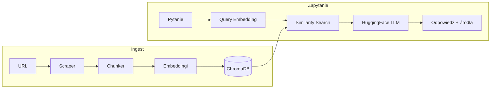

# Cortex RAG — Przewodnik

Ten dokument wyjaśnia **do czego służy narzędzie**, **jak z niego korzystać z perspektywy użytkownika** oraz **jak działa pod spodem** — w sposób przystępny, ale szczegółowy.

Instalacja, szybki start i podstawowe komendy: [README.md](../README.md).
Tutorial krok po kroku: [INSTRUCTIONS.md](INSTRUCTIONS.md).

---

## 1. Do czego służy?

**Cortex** to aplikacja CLI, która:

1. **Scrapuje** artykuły techniczne z podanych URL-i (httpx + BeautifulSoup).
2. **Dzieli** treść na nachodzące na siebie fragmenty (chunki) odpowiednie do embeddingu.
3. **Indeksuje** chunki w lokalnym wektorowym magazynie **ChromaDB** z embeddingami sentence-transformer.
4. **Wyszukuje** relevantne chunki za pomocą semantycznego similarity search (z opcjonalnym query expansion przez RRF).
5. **Generuje** uziemione odpowiedzi używając **HuggingFace Inference API** (domyślnie) lub **OpenAI** (opcjonalnie).
6. **Ewaluuje** jakość retrievalu metrykami MRR, Hit Rate i NDCG.
7. **Wizualizuje** bazę wiedzy (mapa dokumentów t-SNE) i porównania eksperymentów (wykresy słupkowe).

W jednym zdaniu: **URL-e → scraping → chunking → embeddingi → ChromaDB → Q&A z ewaluacją**.

---

## 2. Architektura wysokiego poziomu

Projekt implementuje **RAG** (Retrieval-Augmented Generation): retrieval jest lokalny i tani (embeddingi na CPU); generacja odpowiedzi używa darmowej warstwy HuggingFace.

```
Faza ingestu (cortex add)
  URL
    → fetch httpx + parsowanie BeautifulSoup
    → usunięcie szumu (nav, footer, scripts)
    → rekursywne dzielenie tekstu
    → ID chunków SHA-256
    → embeddingi sentence-transformer (CPU)
    → upsert do ChromaDB (persystencja na dysku)

Faza zapytań (cortex ask)
  Pytanie użytkownika
    → (opcjonalnie) LLM generuje warianty zapytania
    → embedding + similarity search w ChromaDB
    → (opcjonalnie) Reciprocal Rank Fusion łączy rankingi
    → top-K chunków jako kontekst
    → HuggingFace chat completion
    → odpowiedź + źródłowe URL-e
```



---

## 3. Moduły i odpowiedzialności

Granice modułów są celowo ostre: jeden plik, jeden główny obszar odpowiedzialności.

| Moduł | Odpowiedzialność |
| --- | --- |
| [`config.py`](../src/cortex/config.py) | Konfiguracja pydantic-settings z `.env`: token HF, modele, ścieżka ChromaDB, parametry chunkingu, ustawienia retrievalu |
| [`scraper.py`](../src/cortex/scraper.py) | Fetch HTTP (httpx), parsowanie HTML (BeautifulSoup), usuwanie tagów szumowych, ekstrakcja treści, dataclass `Article` |
| [`chunker.py`](../src/cortex/chunker.py) | Rekursywne dzielenie tekstu z overlapem, deterministyczne ID chunków SHA-256, dataclass `Chunk` |
| [`store.py`](../src/cortex/store.py) | Leniwa inicjalizacja ChromaDB, indeks HNSW z cosine distance, operacje upsert/query, setup funkcji embeddingów |
| [`retriever.py`](../src/cortex/retriever.py) | Prosty retrieval lub multi-query expansion z Reciprocal Rank Fusion, dataclass `SearchResult` |
| [`generator.py`](../src/cortex/generator.py) | HuggingFace InferenceClient, dekorator retry z exponential backoff, generacja odpowiedzi, generacja wariantów zapytań |
| [`evaluator.py`](../src/cortex/evaluator.py) | Metryki MRR, Hit Rate, NDCG, dataclassy `EvalQuery`/`EvalResult`/`EvalReport`, persystencja JSON |
| [`visualizer.py`](../src/cortex/visualizer.py) | Wykres rozrzutu t-SNE embeddingów, grupowany wykres słupkowy do porównania metryk, matplotlib z ciemnym motywem |
| [`cli.py`](../src/cortex/cli.py) | Komendy Typer (`add`, `ask`, `eval`, `viz`, `info`, `clear`), wyjście Rich console |

**Punkty wejścia:**

- `cortex` → `cortex.cli:app` (zdefiniowane w `pyproject.toml`)
- `python -m cortex` → `src/cortex/__main__.py`

---

## 4. Przepływ użytkownika CLI

### 4.0 Tryb “GUI” (menu interaktywne)

Najprostszy sposób użycia to uruchomienie Cortex bez subkomendy — wtedy startuje interaktywne menu (tekstowe GUI), które prowadzi przez ingest, Q&A, ewaluację i wizualizacje:

```bash
uv run cortex
```

Menu pozwala m.in.:
- dodać URL-e (ingest)
- zadawać pytania (Q&A)
- podejrzeć statystyki (`info`)
- generować wizualizacje (`viz docs`, `viz metrics`)
- uruchomić ewaluację (`eval`)
- zarządzać źródłami (lista/usuwanie/clear + generowanie pytań ewaluacyjnych)

### 4.1 Ingestowanie artykułów

```bash
uv run cortex add https://example.com/artykul1 https://example.com/artykul2
```

1. Dla każdego URL: pobierz HTML, wyekstrahuj tytuł i główną treść.
2. Usuń tagi szumowe (`nav`, `header`, `footer`, `script`, `style`, `aside`, `form`).
3. Podziel treść na nachodzące chunki (domyślnie: 500 znaków, 50 overlap).
4. Wygeneruj deterministyczne ID chunków (hash SHA-256 treści).
5. Upsert chunków do ChromaDB (idempotentne — ponowne uruchomienie jest bezpieczne).

### 4.2 Interaktywne Q&A

```bash
uv run cortex ask
```

1. Sprawdź czy baza wiedzy istnieje.
2. Wejdź w interaktywną pętlę: wpisuj pytania, otrzymuj odpowiedzi.
3. Dla każdego pytania:
   - Pobierz top-K podobnych chunków z ChromaDB.
   - Opcjonalnie rozszerz zapytanie na warianty i połącz rankingi (jeśli `USE_QUERY_EXPANSION=true`).
   - Zbuduj kontekst z pobranych chunków.
   - Wywołaj HuggingFace LLM z system promptem wymuszającym uziemione odpowiedzi.
   - Wyświetl odpowiedź i źródłowe URL-e.
4. Wyjdź przez `exit`, `quit`, `q`, lub Ctrl+C.

### 4.3 Ewaluacja retrievalu

```bash
uv run cortex eval --name "baseline"
```

1. Załaduj pytania ewaluacyjne z `data/eval/questions.json` (plik lokalny). Jeśli jeszcze go nie masz, skopiuj szablon z `examples/questions.example.json` i go edytuj.
2. Dla każdego pytania: pobierz chunki, zapisz źródłowe URL-e.
3. Oblicz MRR (Mean Reciprocal Rank) i Hit Rate.
4. Wyświetl kolorową tabelę wyników z benchmarkami jakości.
5. Zapisz raport JSON do `data/eval/results/eval_<name>.json`.

### 4.4 Wizualizacja

```bash
uv run cortex viz docs      # mapa dokumentów t-SNE
uv run cortex viz metrics   # wykres porównania eksperymentów
```

### 4.5 Komendy pomocnicze

```bash
uv run cortex info   # pokaż statystyki bazy wiedzy i konfigurację
uv run cortex clear  # usuń bazę wiedzy (z potwierdzeniem)
```

---

## 5. Konfiguracja (`config.py`)

Konfiguracja używa **pydantic-settings** z następującą kolejnością priorytetów:
1. Zmienne środowiskowe
2. Plik `.env` w katalogu roboczym
3. Wartości domyślne

| Ustawienie | Domyślnie | Opis |
| --- | --- | --- |
| `HF_TOKEN` | (wymagane) | Token API HuggingFace |
| `EMBEDDING_MODEL` | `HuggingFaceH4/zephyr-7b-beta` | Model do embeddingów sentence-transformer |
| `CHROMA_DIR` | `.chroma` | Katalog persystencji ChromaDB |
| `COLLECTION_NAME` | `cortex` | Nazwa kolekcji ChromaDB |
| `CHUNK_SIZE` | `500` | Maksymalny rozmiar chunka w znakach |
| `CHUNK_OVERLAP` | `50` | Nakładanie się sąsiednich chunków |
| `TOP_K` | `5` | Liczba wyników do pobrania |
| `USE_QUERY_EXPANSION` | `false` | Włącz multi-query retrieval z RRF |

**Uwaga:** Pole `generation_model` jest używane w `generator.py`, ale nie jest obecnie zdefiniowane w `config.py`. Należy je dodać, aby generator działał.

---

## 6. Szczegóły techniczne

### 6.1 Scraping (`scraper.py`)

- **Klient HTTP:** httpx z timeoutem 30s, śledzeniem przekierowań, własnym User-Agent.
- **Ekstrakcja treści:** Priorytetowe selektory `main` → `article` → `[role=main]` → `#content` → `#main` → `body`.
- **Usuwanie szumu:** Tagi usuwane przed ekstrakcją: `nav`, `header`, `footer`, `script`, `style`, `aside`, `form`.
- **Czyszczenie tekstu:** Zwijanie 3+ kolejnych newline do 2, usuwanie linii tylko z whitespace.

### 6.2 Chunking (`chunker.py`)

- **Strategia:** Rekursywne dzielenie z coraz drobniejszymi separatorami: `\n\n` → `\n` → `. ` → ` ` → twarde cięcie.
- **Overlap:** Ostatnie N znaków poprzedniego chunka dodane na początek następnego dla ciągłości kontekstu.
- **Minimalny rozmiar:** Fragmenty poniżej 30 znaków są odrzucane.
- **ID chunków:** Pierwsze 16 znaków hex hasha SHA-256 treści — deterministyczne i idempotentne.

### 6.3 Magazyn wektorowy (`store.py`)

- **Leniwa inicjalizacja:** Klient ChromaDB i kolekcja tworzone przy pierwszym dostępie (nie przy imporcie).
- **Funkcja embeddingów:** `SentenceTransformerEmbeddingFunction` z `normalize_embeddings=True` (krytyczne dla cosine similarity).
- **Metryka odległości:** Cosine distance przez indeks HNSW (`space: cosine`).
- **Persystencja:** `PersistentClient` zapisuje na dysk po każdej operacji.
- **Telemetria:** Wyłączona (`anonymized_telemetry=False`).

### 6.4 Retrieval (`retriever.py`)

**Tryb prosty:**
- Embedduj zapytanie, znajdź top-K najbliższych chunków po cosine distance.
- Zwróć obiekty `SearchResult` z treścią, metadanymi i wynikiem podobieństwa.

**Tryb query expansion** (gdy `USE_QUERY_EXPANSION=true`):
1. Wygeneruj N wariantów zapytania używając LLM.
2. Pobierz top-K dla każdego wariantu.
3. Połącz rankingi używając **Reciprocal Rank Fusion** (RRF):
   ```
   score(doc) = Σ 1/(k + rank)  gdzie k=60
   ```
4. Zwróć top-K z połączonego rankingu.

### 6.5 Generacja (`generator.py`)

- **Provider:** HuggingFace Inference API (`provider="hf-inference"`) — darmowa warstwa, z limitami.
- **Logika retry:** Dekorator z exponential backoff (baza 2s, max 3 próby).
- **Bez retry:** HTTP 402 (wyczerpane kredyty) kończy się natychmiast.
- **System prompt:** Instruuje model, żeby odpowiadał TYLKO na podstawie kontekstu, przyznawał gdy informacji brakuje.
- **Temperatura:** 0.2 dla odpowiedzi (faktyczne), 0.7 dla wariantów zapytań (różnorodne).

### 6.6 Ewaluacja (`evaluator.py`)

**Metryki zaimplementowane od zera:**

| Metryka | Wzór | Interpretacja |
| --- | --- | --- |
| MRR | `(1/N) × Σ(1/rank_pierwszego_relevantnego)` | 0.6+ dobry, 0.8+ doskonały |
| Hit Rate | `(zapytania z relevantem w top-K) / N` | 0.7+ dobry, 0.9+ doskonały |
| NDCG@K | `DCG / ideal_DCG` gdzie `DCG = Σ(rel / log2(rank+2))` | Uwzględnia jakość całego rankingu |

**Format pliku ewaluacyjnego** (np. `data/eval/questions.json`):
```json
[
  {"id": "q1", "question": "What is RAG?", "relevant_source": "huggingface.co"}
]
```

### 6.7 Wizualizacja (`visualizer.py`)

- **Mapa dokumentów:** Redukcja wymiarowości t-SNE (384D → 2D), punkty kolorowane po domenie.
- **Wykres metryk:** Grupowany wykres słupkowy porównujący MRR i Hit Rate między eksperymentami.
- **Stylizacja:** Ciemne tło (`#1a1a2e`), jasny tekst, linie odniesienia na 0.6 i 0.8.
- **Wymagania:** Minimum 10 chunków dla t-SNE (ograniczenie perplexity).

---

## 7. Ograniczenia i świadome kompromisy

- **Jedna baza wiedzy:** Jedna kolekcja ChromaDB na raz. Zmiana projektu wymaga `clear` + ponowny ingest.
- **Brak inkrementalnych aktualizacji:** Ponowny ingest tego samego URL jest idempotentny (upsert), ale nie ma wykrywania różnic.
- **Fokus na angielski:** Scraper i prompty zakładają treść po angielsku.
- **Limity rate:** Darmowa warstwa HuggingFace ma limity requestów; dekorator retry obsługuje przejściowe błędy.
- **Brak autentykacji:** Scraper nie może pobierać treści za paywallem lub logowaniem.
- **Embeddingi na CPU:** Sentence-transformers działają na CPU (wolniej, ale bez wymagań GPU).

---

## 8. Gdzie szukać / debugować

| Temat | Plik / symbol |
| --- | --- |
| Fetch HTTP, ekstrakcja treści | `scraper.py` — `scrape_article`, `_CONTENT_SELECTORS`, `_NOISE_TAGS` |
| Rozmiar chunków, overlap, separatory | `chunker.py` — `TextChunker.__init__`, `_split_recursive` |
| Model embeddingów, setup ChromaDB | `store.py` — `_get_collection`, `SentenceTransformerEmbeddingFunction` |
| Similarity search, fuzja RRF | `retriever.py` — `retrieve`, `_reciprocal_rank_fusion` |
| Prompty LLM, logika retry | `generator.py` — `generate_answer`, dekorator `retry` |
| Metryki ewaluacji | `evaluator.py` — `EvalResult.reciprocal_rank`, `ndcg_at_k` |
| t-SNE, wykresy słupkowe | `visualizer.py` — `visualize_documents`, `visualize_metrics` |
| Komendy CLI, wyjście Rich | `cli.py` — `add`, `ask`, `eval`, `viz`, `info`, `clear` |
| Domyślne wartości konfiguracji | `config.py` — klasa `Config` |

Razem z [README.md](../README.md) i [INSTRUCTIONS.md](INSTRUCTIONS.md), to powinno wystarczyć do zrozumienia całego pipeline'u: **od URL-i artykułów do zewaluowanych odpowiedzi RAG**.
